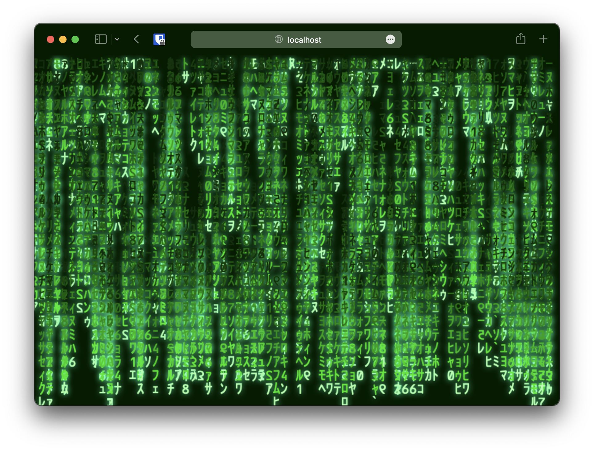

# JS Matrix Rain

Matrix Code Rain Effect on pure Javascript, using HTML5 Canvas API.

	

		
	

[Live demo here](https://leandrosq.github.io/js-matrix-effect/)

## Project

| Name | Description |
| -- | -- |
| Eslint | For linting and semantic analysis |
| Github actions | For CI, building and deploying to github pages |
| Gulp | For tooling and build manager |
| Babel | For transpiling ES6 code |
| Browserify | For bundling and compiling |
| Thomas W. Otto [Matrix font](https://www.fontspace.com/matrix-code-nfi-font-f11467) | For the font |
